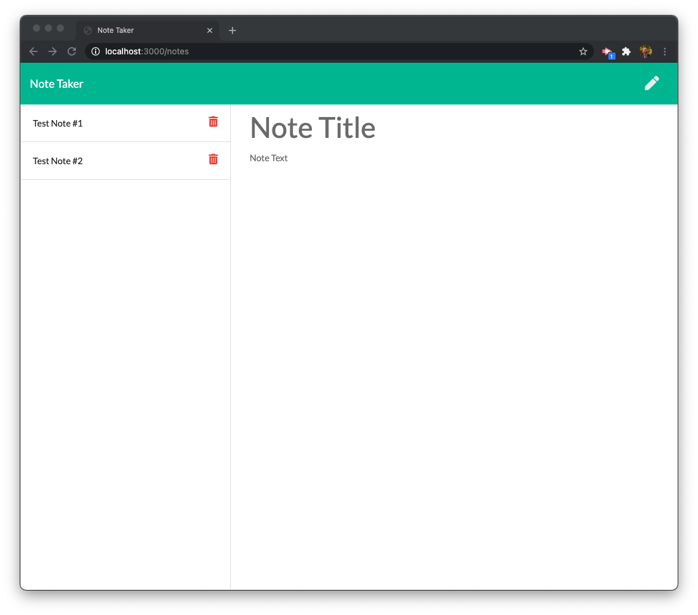
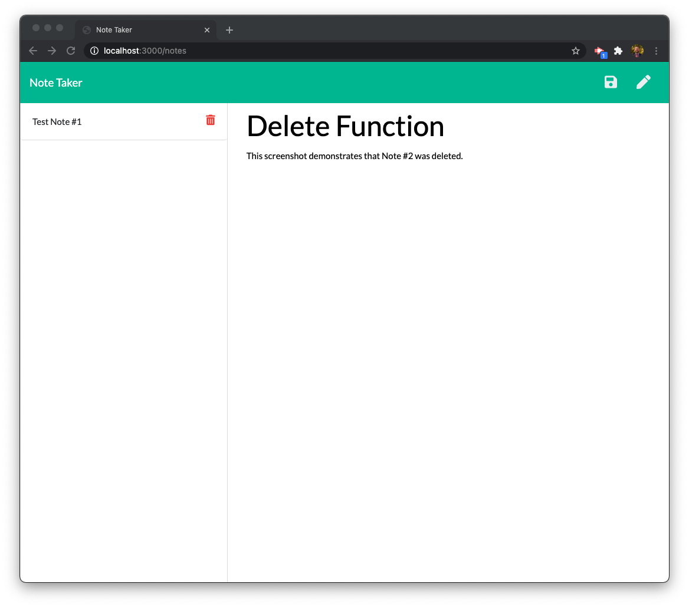
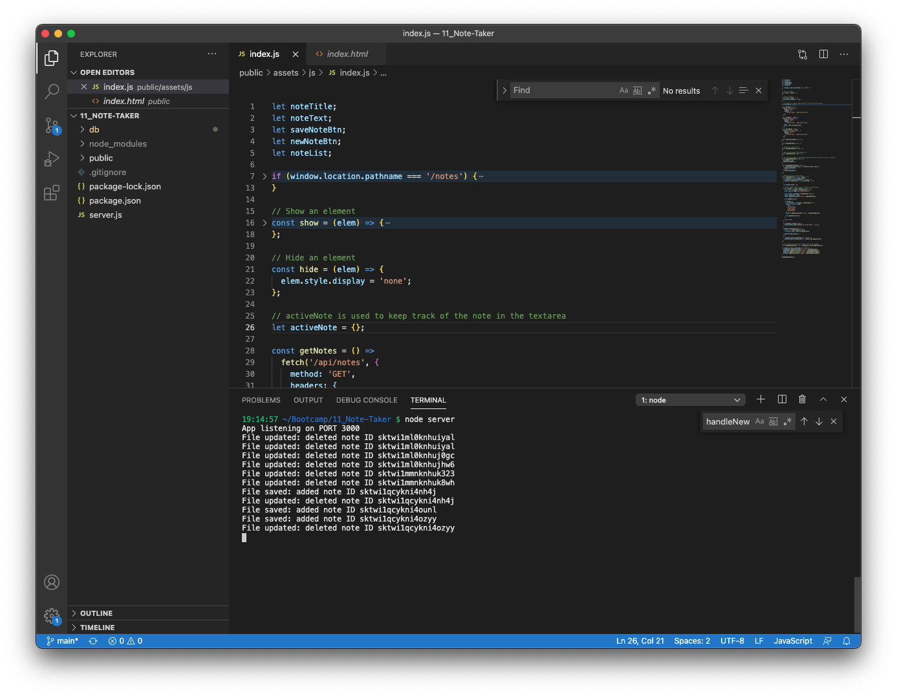

  # Note Taker 

  
  
  ## Description

  The Note Taker app provides a quick and easy way to make notes. This project utilizes Node and the express, FS, and uniqid modules. I created express routes that allow data in a .JSON file to be manipulated via API's. The UI code was provided ahead of time. This project concentrated on the backend. 

  ## Table of Contents 
  
  - [Installation](#installation)
  - [Usage](#usage)
  - [Contribute](#contribute)
  - [Test](#test)
  - [License](#license)
  - [Questions](#questions)
  
  ## Installation

  You download the source code or clone the git repository, Node, and dependencies. 
  
  ## Usage

  You use the app by starting the Node server, and then navigating to your app's URL. If deployed on Heroku, go to the app's URL. If deployed locally, the app will use http://localhost:3000. Then click "Get Started" and write a note! You can also test the delete function by creating new notes and deleting them. 
  
  
  
  
  
  ## Contribute

  Feel free to email me or push to GitHub on your own branch to suggest new features or improvements. 
  
  ## Test

  Test the app by creating new notes and then deleting them!
  
  ## License
  
  
  Copyright (c) Sam Gates. All rights reserved. 
  Licensed under the [Apache](https://www.apache.org/licenses/LICENSE-2.0.txt) license.
  
  ## Questions
  
  Check out my [GitHub Profile](https://github.com/sg0703).
  
  Email with questions! You can reach me at sam.j.gates@gmail.com.
  